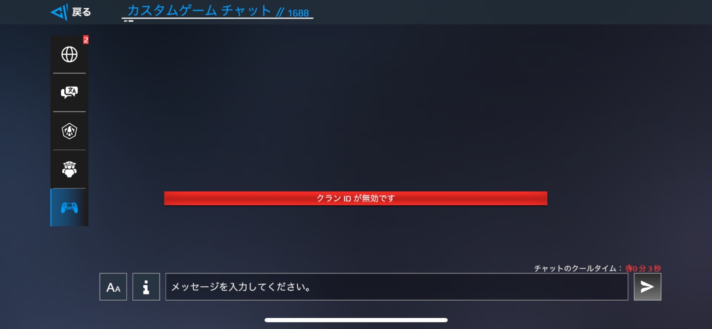

# Modern Warships チャット機能
今回，チャットの機能を色々検証した。カスタムルームを作成し，カスタムチャットでを使用した(2024/09/16)。カスタムチャットの仕様はグローバルチャットやクランチャットでも同様だと思う(未確認)。

動機は，戦闘行くと落ちるから。あとMarkdown自分で書いてみたかった。

## コマンド
クランおよびカスタムの招待用カードを発行する`post_invite_card`というコマンドを発見した(招待用のコピペボタンがある)。それ以外は未確認。

ここでは，何かしら意味を持つ文字列をコマンドと呼ぶ。

以下，変数部分は`<変数>`と表記する。変数名は勝手に名付けた。

### クラン招待
#### 基本書式
```
post_invite_card clan_<クランID>
```

#### 制約事項
- `post_invite_card`の直後の空白は任意個でいい
  - なぜか空白0個でいけた

- `クランID`は6桁の英大文字と数字(トップ50のクランをぱっと見)
  - 自分が在籍しているクランのIDでなければ入力不可になる(赤メッセージ出る)

- 5分間のクールタイム有り(黄色メッセージ出たり出なかったり)
  - 別チャットでも再起動してもリセット無し

- `clan`の直後が`_`以外であれば通常の文字列として入力できた

#### 例
- 在籍しているクランの`クランID`を使用した場合
  実行コマンド
  ```
  post_invite_card clan_5DYTQ5
  ```

  実行結果
  

  ただコピペするだけ。想定している使い方。`5DYTQ5`はZIPANGの`クランID`。

- 在籍していないクランの`クランID`を使用した場合
  実行コマンド
  ```
  post_invite_card clan_5DYTQ6
  ```

  実行結果
  

  `クランID`が`5DYTQ6`であるクランの有無は不明。

- 末尾に空白と1個以上の任意の文字を付加した場合
  実行コマンド
  ```
  post_invite_card clan_5DYTQ5 a
  ```

  実行結果
  

  連投できない。

### カスタム招待
#### 基本書式
```
post_invite_card custom_roomId<ルームID>&class<艦種ID>&tier<ティアID>&count<戦闘形式ID>&cardmap_<マップID>
```

見やすく整形(文法無視)

```
post_invite_card
   custom_roomId<ルームID>  <- なんでスネークケースかキャメルケースか統一しないの
  &class<艦種ID>
  &tier<ティアID>
  &count<戦闘形式ID>
  &cardmap_<マップID>  <- なんでこれだけ_で区切るの
```

#### 制約事項
- 過不足無くこの順でなければ入力不可になる
  - `tier`以降に`&`または`count`が存在しなければ通常の文字列として入力できた(全通り調べたわけではない)

- `post_invite_card`の直後の空白は任意個でいい
  - なぜか空白0個でいけた

- 続く引数を`&`で区切る
  - 空白等が存在すると入力不可になる

- `ルームID`は4桁の数字
  - 現在参加しているカスタムルームのIDでなければ`作成したカスタムルームは招待状の期限が切れました。次の招待をお待ち下さい`を入力したことになる

- `艦種ID`は`all`または`0`から`30`までの整数の`,`区切りの羅列
  - 連続した`,`または末尾の`,`が存在すると入力不可になる
  - `31`-`40`がだめだったから`41`以上もだめそう
  - 重複可能
  - 個数無制限
  - `利用可能なクラス`として，ロゴが記述順に表示される
  - 7個で改行される(端末差あるかも)
  - 個数に応じて招待用カードの領域が下に伸びる
  - 10行(70個)でチャット画面の下端に到達(端末差あるかも)

  <details>
    <summary>艦種対応表</summary>

    |艦種ID   |艦種名                            |
    |:-------:|:-------------------------------:|
    |`all`    |全て(`0,1,2,3,4,5,6,7,8,10`と等価)|
    |`0`      |コルベット艦                      |
    |`1`      |フリゲート艦                      |
    |`2`      |駆逐艦                            |
    |`3`      |巡洋艦                            |
    |`4`      |戦艦                              |
    |`5`      |航空母艦                          |
    |`6`      |潜水艦                            |
    |`7`      |エクラノプラン                     |
    |`8`      |強襲型空母                         |
    |`9`      |無(なんで)                         |
    |`10`     |強襲揚陸艦                         |
    |`11`-`14`|無                                |
    |`15`     |不明(カブトムシ?)                  |
    |`16`-`17`|無                                |
    |`18`     |スカイキャリア                     |
    |`19`-`29`|無                                |
    |`30`     |無人潜水艇(公称不明)                |
  </details>

- `ティアID`は`all`または`1`から`3`までの整数の`,`区切りの羅列
  - 重複可能
  - 個数無制限
  - `利用可能なティア`として，ロゴが昇順に表示される
  - 13.5個で背景の右端に到達(端末差あるかも)
  - 16個でチャット画面の右端に到達(端末差あるかも)
  - それ以上は改行されず右にあふれる

- `戦闘形式ID`は`1`から`5`までの整数
  - 1チームの人数と同じ
  - たぶんだけど，観戦できるなら1対1の戦闘を募集しても5対5で戦闘できると思う(未確認)

- `マップID`はマップを識別する文字列
  - なぜ英語名と揃えないのか不思議
  - カスタムの招待用カードが発行される(正常に実行される)ってことはそういう名前(ID)のマップがあるということ(`_TDM`有り無しの差は何)

  <details>
    <summary>ゲームモード対応表</summary>

    |モード日本語名                  |モード英語名    |マップIDの接尾辞|
    |:-----------------------------:|:-------------:|:-------------:|
    |チームデスマッチ(私は通常戦と呼ぶ)|TEAM DEATHMATCH|TDM            |
    |占領戦                          |DOMINATION     |DM             |
    |共闘戦                          |TANDEM WARS    |TW             |
    |護衛戦                          |ESCORT MODE(?) |EC             |

    マップIDの接尾辞は当てずっぽうで見つけた。
  </details>

  <details>
    <summary>マップ対応表</summary>

    |マップID                 |マップ英語名        |マップ日本語名       |占領戦|共闘戦 |護衛戦|` `|`_TDM`|`_DM`|`_TW`|`_EC`|備考|
    |:----------------------:|:-----------------:|:------------------:|:----:|:----:|:-----|:-:|:----:|:---:|:---:|:---:|:--:|
    |`Greenlands`            |Greenlands         |緑の諸島             |X     |X     |X     |O  |X     |X    |X    |X    |    |
    |`Strom`                 |Strom              |嵐                  |X     |X     |X     |O  |O     |X    |X    |X    |    |
    |`UnexploredRocks`       |Unexplored Rocks   |未踏の岩             |X     |X     |X     |O  |X     |X    |X    |X    |    |
    |`StormDay`              |Islands of Iceland |アイスランド諸島      |X     |X     |X     |O  |X     |X    |X    |X    |    |
    |`IceWorld`              |Arctic             |北極圏               |X     |O     |X?    |O  |X     |X    |O    |X    |護衛戦あったけど消えた|
    |`VikingBay`             |Viking Bay         |海賊の入り江         |O?    |O     |X     |O  |X     |O    |O    |X    |占領戦の神秘湾はサムネは海賊の入り江と同じな気がする，`_DM`付加して表示されるマップ名は海賊の入り江 -> 同じらしい，変な名前付けんな|
    |`StonePeaks`            |Stone Peaks        |秘境の岩山           |X     |X     |X     |O  |X     |X    |X    |X    |    |
    |`TwoSamurai`            |Two Samurai        |二人の侍             |O     |O     |O     |O  |X     |O    |O    |O    |通常戦と占領戦でマップ構造が同一|
    |`HiddenDragon_TDM`      |Hidden Dragon      |隠れた龍             |X     |O     |X     |O  |O     |X    |O    |X    |    |
    |`MonstrousMaelstorm_TDM`|Monstrous Maelstorm|巨大うずまき         |O     |X     |O     |O  |O     |**X**|X    |O    |**なぜ`_DM`無い**|
    |`AridFrontier_TDM`      |Arid Frontier      |砂漠のフロンティア    |X     |O     |O     |O  |O     |X    |O    |X    |    |
    |`PolarFrontier_TDM`     |Polar Frontier     |極地戦線             |X     |X     |X     |X  |O     |X    |X    |X    |    |
    |`LostCity_TDM`          |Lost City          |失われた都市         |O     |X     |X     |O  |O     |**X**|X    |**O**|**なぜ`_DM`無い**，**なぜ`_EC`有る**，`_EC`付加して表示されるマップ名は二人の侍(は?)|
    |`Strom_TDM`             |Strom              |嵐                  |X     |X     |X     |O  |O     |X    |X    |X    |石油リグみたいなのある方|

    ` `，`_TDM`，`_DM`，`_TW`，`_EC`は`マップID`の接頭辞。` `は接頭辞が無いことを表す。占領戦，共闘戦，護衛戦におけるOとXは，そのマップが各モードでプレイ可能かどうかを表す。` `，`_TDM`，`_DM`，`_TW`，`_EC`におけるOとXは，各接頭辞を付加または置換した`マップID`を使用して，招待用カードが発行されるかどうかを表す。
  </details>

- 完全に同じ文字列を再度入力すると5分間のクールタイム有り(黄色メッセージ出たり出なかったり)
  - 別チャットでも再起動してもリセット無し
  - 末尾に空白と1個以上の任意の文字を付加すると回避できる

- 他人が作成したカスタムルームの`ルームID`を使用して上記のコマンドを入力したが，5分間のクールタイム有りの黄色メッセージ出たり，`作成したカスタムルームは招待状の期限が切れました。次の招待をお待ち下さい`になったりする

- 既に参加しているカスタムルームの`ルームID`を使用した招待用カードには，参加ボタンが存在しない

#### 例
- 参加しているカスタムの`ルームID`を使用した場合
  実行コマンド
  ```
  post_invite_card custom_roomId2453&classall&tierall&count5&cardmap_Greenlands
  ```

  実行結果
  

  ただコピペするだけ。想定している使い方。

- 入力可能なすべての`クラスID`と重複含め複数の`ティアID`を使用した場合
  実行コマンド
  ```
  post_invite_card custom_roomId8460&class0,1,2,3,4,5,6,7,8,9,10,11,12,13,14,15,16,17,18,19,20,21,22,23,24,25,26,27,28,29,30&tier3,2,1,1,2,3&count5&cardmap_Greenlands
  ```
  実行結果

  

  `クラスID`が`15`のロゴが，カブトムシにしか見えない。利用可能なティアは記述順に依らず昇順に表示される。

- 利用可能なクラスにコルベット艦を，利用可能なティアに3を使用した場合
  実行コマンド
  ```
  post_invite_card custom_roomId9279&class0&tier3&count5&cardmap_Greenlands
  ```

  実行結果
  

  コルベット艦はティア1にのみ存在するが，参加の可否は不明。たぶんカスタムルーム作成時のルールも基に，参加の可否を決定すると思う(未確認)。

- 利用可能なクラスに戦艦，強襲型空母，強襲揚陸艦を，利用可能なティアに1を使用した場合
  実行コマンド
  ```
  post_invite_card custom_roomId9128&class4,8,10&tier1&count5&cardmap_Greenlands
  ```

  実行結果
  

  戦艦，強襲型空母，強襲揚陸艦はティア3にのみ存在するが，参加の可否は不明。たぶんカスタムルーム作成時のルールも基に，参加の可否を決定すると思う(未確認)。

- 利用可能なクラスに不明，スカイキャリア，無人潜水艇を使用した場合
  実行コマンド
  ```
  post_invite_card custom_roomId9997&class15,18,30&tierall&count5&cardmap_Greenlands
  ```

  実行結果
  

  参加の可否は不明。たぶんカスタムルーム作成時のルールも基に，参加の可否を決定すると思う(未確認)。

  uuvがあるのに，usv(無人水上艇，公称不明)，uh(無人ホバークラフト，公称不明)，爆撃機，ドローン，攻撃機，戦闘機，ヘリコプター，無人艇(ショップのみ)がないのはなんで。

  <details>
    <summary>無人艇におけるロゴ対応表</summary>

    |艦種名           |ロゴ|
    |:--------------:|:--:|
    |無人艇           ||
    |無人潜水艇       ||
    |無人水上艇       ||
    |無人ホバークラフト||

    無人潜水艇，無人水上艇，無人ホバークラフトを無人艇に統一するのかしないのかはっきりして。
  </details>

- `艦種ID`に`9`を70個列挙，`ティアID`に`1`を17個列挙した場合
  実行コマンド
  ```
  post_invite_card custom_roomId2556&class9,9,9,9,9,9,9,9,9,9,9,9,9,9,9,9,9,9,9,9,9,9,9,9,9,9,9,9,9,9,9,9,9,9,9,9,9,9,9,9,9,9,9,9,9,9,9,9,9,9,9,9,9,9,9,9,9,9,9,9,9,9,9,9,9,9,9,9,9,9&tier1,1,1,1,1,1,1,1,1,1,1,1,1,1,1,1,1&count5&cardmap_Greenlands
  ```

  実行結果
  

  ティア1のロゴが16個表示されていて，17個目が表示されていない。簡単にチャットを荒らせる。

## 入力制限
- <0個以上の任意の文字>http<1個以上の空白以外の文字>は入力していないことになる
  - Http(hTtp，htTp，httPでも可)にすると回避できる
    - ブラウザにそのままコピペok
    - でも=が弾かれるからクエリパラメータは付けられない
  - 全角(ｈｔｔｐ)は入力できたがブラウザでは無理
- ☆♪→¥$€°○+×÷<=>〒^|のいずれも入力していないことになる
  - 全角も同様
- 行頭の空白と行末の空白はトリミングされる
  - 全角も同様
- 外部からコピペすると改行は空白に変換される
- 1人でカスタムで連投してたら赤メッセージで`利用不可`とでた
  - 1分ぐらいミュート食らってたのかも
  - 再起動で直ったのかも
- 入力可能な最大文字数は300文字
  - 全角も同様，ちょっと意外

## その他
- このゲーム全般にシノニム(同音異義語)が多すぎる，たぶん和訳がてきとう
